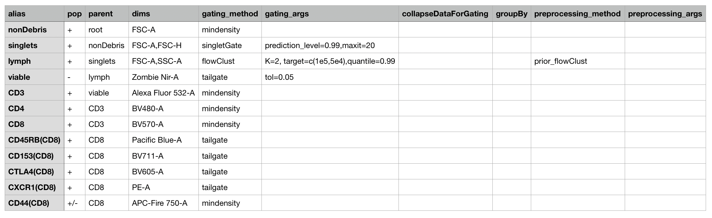
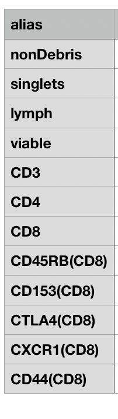
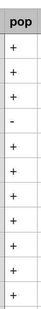
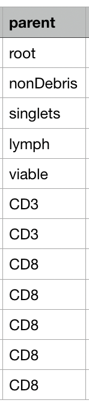

# Create .csv 

The creation of a .csv gating template is arguably the most important step to automating flow cytometry analysis. The .csv template that you create will tell `openCyto` how to gate your data. Included with this tutorial is a partial .csv template that can be used to gate the sample data. Generally, .csv templates will look like this:

```{r show_temp, echo=FALSE, out.width = '60%'}

```

## .csv Gating Template Structure  

In the gating template, each row corresponds to a single cell population and the method used to gate that population. When read into R, the .csv will direct gating based on parameters listed in each row and column. The .csv must contain 10 predefined columns as seen here:

```{r show_cols, echo=FALSE, out.width = '60%'}

```

### `alias`  

The first column must be titled `alias`. This is where you will put your cell population names. Remember, each row corresponds to a single cell population. Population names in the `alias` column must be unique. 

```{r show_alias, echo=FALSE, out.width = '60%'}

```

### `pop`  

The second column must be titled `pop`. This column will contain a `+` or `-` to designate which subset or quadrant will be gated. A `+` will gate the positive subset while a `-` will gate the negative. This column can only contain strings of `+` and `-`, so do not use any characters as separators for quadrant gates.  

```{r show_pop, echo=FALSE, out.width = '60%'}

```

### `parent`  

The third column must be titled `parent`. This column refers to the parent cell population, or where the current cell population originates from. Similar to the `alias` column, `parent` names must be unique. This column cannot contain any commas, otherwise `openCyto` will assume the population has multiple parents and you will get an error message.  

```{r show_parent, echo=FALSE, out.width = '60%'}

```

### Remaining template columns  


`dims`- channel or marker names for gating  
`gating_method`- gating function (supported options listed above)  
quadrantGate  
rangeGate  
quantileGate  
mindensity  
tailgate  
cytokine  
flowClust  
boundary  
singletGate  
transitional  
plolyfunctionalityGate  
flowDensity 
`gating_args`- arguments to be passed to gating function
`collapseDataforGating`- data is collapsed and replicated across all samples  
`groupBy`- used to group samples into unique combinations  
`preprocessing_method`- preprocessing function  
`preprocessing_args`- arguments for preprocessing function  

## Creating the Template    

The gating template can be created manually or assisted by the use of the `templateGen()` function. The function `templateGen()` will input the `alias`, `pop`, `parent`, and `dims` columns and the rest must be completed manually. To use `templateGen()`, you must input a GatingHierarchy object. In this example, that is **gh**, the subset created from **gating_set**.  

```{r template_gen, warning=FALSE, message=FALSE}
gt <- templateGen(gh)
head(gt)
```

The auto-filled template will generate within the R Console and can then be saved locally with the following code. You will see that all columns besides the first four will contain NA values. These are the values that must be manually input to complete the .csv.  

```{r save_template, warning=FALSE, message=FALSE}
write.csv(gt, "gt.csv")
```

If you choose to create the gating template manually, the same conventions must be followed. Start with a blank spreadsheet. Next, fill in the 10 required column names. From there, use the manual gating hierarchy to fill in each cell population `alias`. Fill in the remainder accordingly.  

There will likely be troubleshooting involved in this process. [This](https://www.bioconductor.org/packages/devel/bioc/vignettes/openCyto/inst/doc/HowToWriteCSVTemplate.html#14_gating_method_that_generates_multiple_populations) is a great place to start if you're seeking more information on the gating template. The `openCyto` [GitHub page](https://github.com/RGLab/openCyto) is also very responsive to issues posted.  

